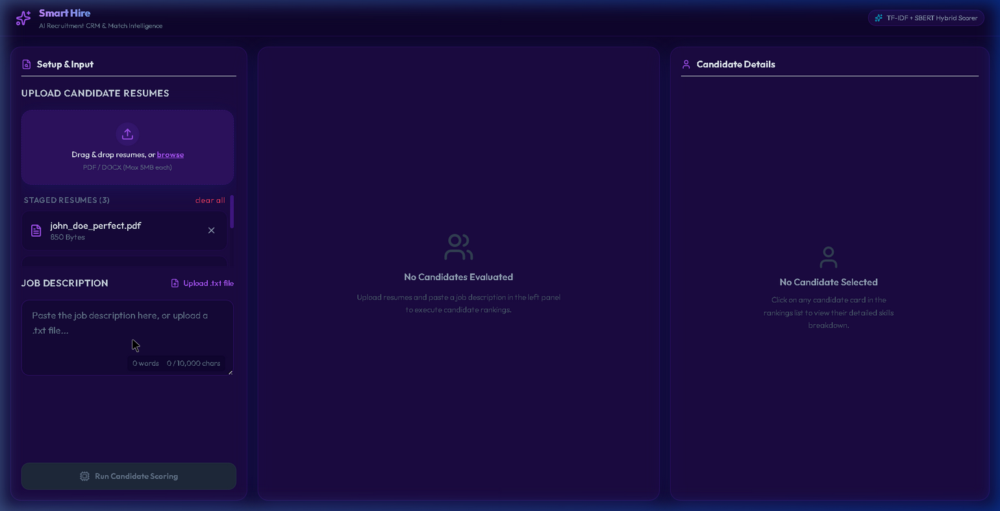

# Smart Hire — AI Recruitment CRM & Match Intelligence

Smart Hire is an AI-powered web application that automates the resume screening and ranking process. It reads uploaded resumes (PDF / DOCX), compares them to a job description using a hybrid NLP scoring engine (combining exact keyword matching with semantic AI embedding search), scores each candidate, and ranks them in a unified recruiters' CRM dashboard.

## 🚀 Key Features

- **Ingest Multiple Resumes**: Upload resumes in PDF or DOCX format.
- **Job Description Parsing**: Input job details dynamically to score candidates against required skills and experience.
- **Lexical & Semantic Hybrid Scorer**:
  - **Lexical (TF-IDF)**: Matches exact technical keywords, abbreviations, and spellings.
  - **Semantic (SBERT)**: Matches context and synonyms (e.g., matching "ML" to "Machine Learning" or "development" to "software engineering").
  - **Recruiter Bias Control**: Interactive sliders to adjust the lexical-vs-semantic weight in real-time.
- **HR CRM Dashboard**: Three-column dashboard containing:
  - **Setup Panel**: Dropzone for files and text area for the Job Description.
  - **Rankings & Pool Analytics**: Interactive sortable candidate lists and visual analytics tabs.
  - **Details Inspector**: Direct view of extracted candidate experience, matched skills, missing skill gaps, job roles, and academic credentials.
- **Pool Analytics Charts**: Built-in SVG analytics dashboards showing score distributions, experience vs. score scatterplots, and skill gap tables.
- **Export Capabilities**: Export shortlists directly as CSV formatted reports.

---

## 🛠️ Tech Stack

### Frontend
- **Framework**: React (Vite)
- **Styling**: Tailwind CSS (Glassmorphism & Sleek Dark theme)
- **Icons**: Lucide React
- **Build tool**: Vite

### Backend
- **Framework**: FastAPI (Python)
- **Database**: SQLite (SQLAlchemy ORM)
- **NLP & Parsing**:
  - **spaCy (`en_core_web_sm`)**: Named Entity Recognition (NER) for extracting dates, education, and experience.
  - **Sentence-Transformers (`all-MiniLM-L6-v2`)**: Generates high-quality sentence embeddings for semantic scoring.
  - **PyPDF2 & python-docx**: Document text extraction.

---

## 📸 Dashboard Preview



---

## 📂 Project Structure

```
├── backend/
│   ├── api/               # Endpoint routes and middleware
│   ├── db/                # Database connection, schemas, and migrations
│   ├── modules/           # Ingestion, preprocessing, NER, and scoring modules
│   ├── main.py            # FastAPI application entrypoint
│   ├── Requirements.txt   # Python dependencies
│   └── Dockerfile         # Backend deployment container
├── frontend/
│   ├── src/
│   │   ├── api/           # API connection client
│   │   ├── components/    # FileUpload, JDInput, ResultsTable, PoolAnalytics
│   │   ├── App.jsx        # Main application component
│   │   └── index.css      # Core styles & Tailwind directives
│   ├── package.json       # Node package manager configurations
│   └── vercel.json        # Vercel Single-Page-App routing configuration
├── docker-compose.yml     # Multi-container orchestration configurations
└── README.md              # Documentation
```

---

## 💻 Local Setup & Installation

### Prerequites
- **Python 3.10+**
- **Node.js 18+ & npm**
- **Git**

### 1. Setup Backend
1. Navigate to the backend directory:
   ```bash
   cd backend
   ```
2. Create and activate a Python virtual environment:
   ```bash
   python -m venv venv
   # On Windows (PowerShell):
   .\venv\Scripts\Activate.ps1
   # On macOS/Linux:
   source venv/bin/activate
   ```
3. Install dependencies:
   ```bash
   pip install -r requirements.txt
   ```
4. Download the spacy language model:
   ```bash
   python -m spacy download en_core_web_sm
   ```
5. Run the FastAPI dev server:
   ```bash
   python main.py
   ```
   *The server will start at `http://localhost:8000`.*

### 2. Setup Frontend
1. Navigate to the frontend directory:
   ```bash
   cd ../frontend
   ```
2. Install npm dependencies:
   ```bash
   npm install
   ```
3. Run the Vite development server:
   ```bash
   npm run dev
   ```
   *The client will start at `http://localhost:5173`.*

---
